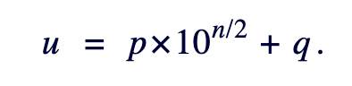
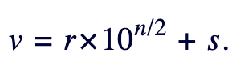
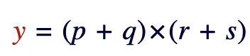
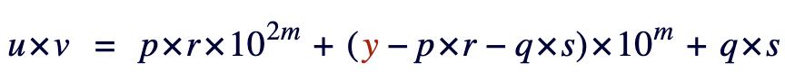
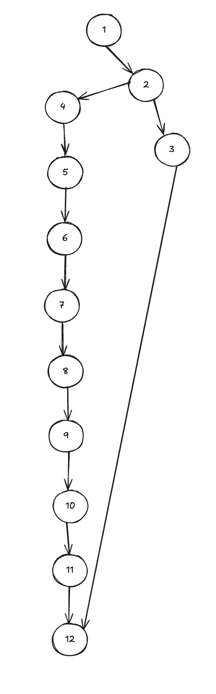
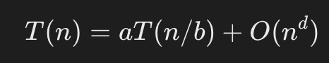
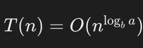

# Algoritmo de Karatsuba

Este é um trabalho desenvolvido para a disciplina de Fundamentos de Projeto e Análise de Algoritmos, ministrada pelo professor João Paulo Aramuni em 2025/1 no bacharelado em Engenharia de Software da PUC Minas.

Consiste na implementação do Algoritmo de Karatsuba para multiplicação eficiente de dois números inteiros na linguagem Python.

O arquivo `main.py` contém o código com a implementação e o arquivo `tests.py` contém alguns cenários de teste.

## Como rodar o projeto

Abra o diretório contem o arquivo no seu terminal de linha de comando e execute `python main.py` ou `python3 main.py` (à depender da versão do Python instalada na sua máquina).

Para rodar os testes, execute o comando `python -m unittest` ou `python3 -m unittest`.

## Versão do Python

Este projeto foi desenvolvido na versão 3.12.3 do Python.

## Explicação das funções

### Arquivo `main.py`

__Objetivo:__ Implementa uma única função, `karatsuba` que realiza a multiplicação entre números grandes de forma mais eficiente.

__Explicação:__ Segundo a [explicação fornecido pelo Prof. Paulo Feofiloff, do Instituto de Matemática e Estatística (IME - USP)](#documentação-e-links-úteis), o algoritmo aplica uma estratégia de dividir e conquistar para multiplicar números grandes. Ele recebe dois números: *u* e *v*, de tamanho *n*.

Ambos os números são decompostos em duas partes:
*p* representa os n/2 dígitos mais significativos de *u*
*q* represena os n/2 dígitos menos significativos de *u*
*r* representa os n/2 dígitos mais significativos de *v*
*s* represena os n/2 dígitos menos significativos de *v*

Ou seja:





Assim temos que:


Podemos chamar u de p + q
E chamar v de r + s
Desta forma, temos que a multiplicaçao u * v pode ser representada como:



*u* * *v* = *p* * *r* * (10 ^ *n*) + (*p* * *s* + *q* * *r*) * (10 ^ (*n*/2)) + *q* * *s*

Essa expressão representa a fase de conquista do algoritmo, que irá se chamar recursivamente, passando as partes dos dígitos que foram separados em n/2 novamente, até que n seja menor ou igual a 3 (condição em que a recursão para).

Portanto, a expressão pode ser reescrita como:


Denotando m como o arrendodamento para cima de n/2, temos a fórmula a seguir, que foi transcrita em algoritmo no arquivo `main.py`:


## Saída da Execução
```
12 * 24 = 288
7 * 8 = 56
12345678 * 87654321 = 1082152022374638
9999991 * 999983 = 9999821000153
12345 * 10000 = 123450000
10000 * 10000 = 100000000
1234 * (-5678) = -7006652
(-1234) * (-5678) = 7006652
```

## Relatório técnico

### Fluxo de controle da função

__Nós:__
1. Início da função
2. Condicional - verifica condição de parada
3. Retorno para a condição de parada
4. Inicialização de m (número de dígitos da metade mais significativa dos números *u* e *v*)
5. Inicialização de p (primeiros *m* dígitos de *u*)
6. Inicialização de q (últimos *n - m* dígitos de *u*)
7. Inicialização de r (primeiros *m* dígitos de *v*)
8. Inicialização de s (últimos *n - m* dígitos de *v*)
9. Chamada recursiva com os dígitos mais significativos
10. Chamadda recursiva com os dígitos menos significativos
11. Chamada recursiva com as somas dos dígitos mais significativos e dos menos significativos
12. Cálculo do produto entre *u* e *v*
13. Retorno do resultado da função 

    _Total_: 13 nós

__Arestas:__
1. Do início da função para a condicional
2. Da condional para o retorno da condição de parada
3. Da condicional para o cálculo de m
4. Do cálculo de m para o cálculo de p
5. Do cálculo de p para o cálculo de q
6. Do cálculo de q para o cálculo de r
7. Do cálculo de r para o cálculo de s
8. Do dálculo de s para a chamada recursiva karatsuba(p, r, m)
9. Da chamada recursiva karatsuba(p, r, m) para a chamada recursiva karatsuba(q, s, m)
10. Da chamada recursiva karatsuba(q, s, m) para a chamada recursiva karatsuba(p + q, r + s, m + 1)
11. Da chamada recursiva karatsuba(p + q, r + s, m + 1) para o cálculo de uv
12. Do cálculo de uv para o retorno do resultado da função

    _Total_: 12 arestas

### Grafo de fluxo



### Cálculo de complexidade ciclomática

A fórmula é dada por M = E - N + 2P

Em que:
E = número de arestas
N = número de nós
P = número de componentes conectados

Para o algoritmo de Karatsuba temos portanto:

M = 12 - 13 + 2(1)
M = 1

### Análise da complexidade assintótica

Como o algoritmo de Karatsuba utiliza uma estratégia de dividir e conquistar, podemos utilizar o teorema mestre para recorrências de divisão e conquista, dado por:



Em que:
a = Número de subproblemas gerados em cada chamada recursiva.
b = Fator pelo qual o tamanho do problema é reduzido em cada nível de recursão.
d = Ordem de crescimento do custo das operações externas (fora das chamadas recursivas), geralmente referente a soma, subtração, divisão, etc.


No caso do algoritmo de Karatsuba, temos:

 a = 3, pois são feitas três chamadas recursivas
 b = 2, pois o tamanho do problema é reduzido pela metade a cada passo
 d = 1, pois as operações adicionais no algoritmo são da ordem de O(n)

Pelo Teorema, temos que:




Ou seja:

T(n) = O(n ^(log2 (3)))
T(n) = O(n ^ 1.585)

## Documentação e links úteis

[Análise de Algoritmos: Karatsuba - Multiplicação de números grandes. Paulo Feofiloff, IME - USP](https://www.ime.usp.br/~pf/analise_de_algoritmos/aulas/karatsuba.html)
[Brilliant.org - Wiki: Karatsuba Algorithm](https://brilliant.org/wiki/karatsuba-algorithm/#complexity-of-karatsuba)
[](https://pt.wikipedia.org/wiki/Teorema_mestre_(an%C3%A1lise_de_algoritmos))

## Licença
Este projeto está licenciado sob a Licença MIT.